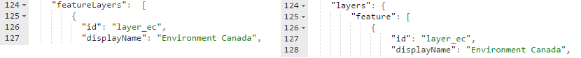
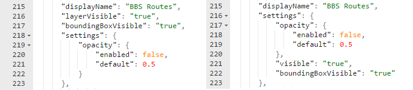
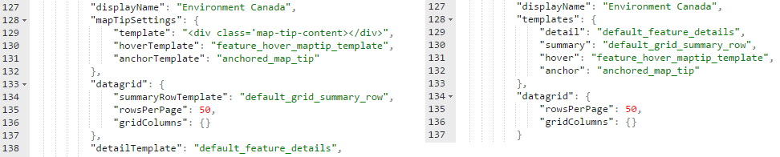
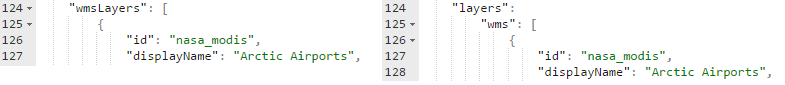

<a name="top" />

# RAMP Configuration Migration Guide - Canada Goose to Dragonfly {#wb-cont}

A number of schema changes were made to the config file in the Dragonfly release of RAMP.  Most of the changes were to facillitate a smaller config file, and to have data in more obvious locations.  

Also note that a number of fields are now optional.  If they are not present in the config file, a default value will be used.  The [config schema](json-config-en.html) will describe these fields.

## Changes to Feature Layers

### Feature Layer Collection

The __featureLayers__ collection now resides under the __layers__ node, and is called __feature__.

### Feature UUID

The __uuid__ field has been removed.  If a RAMP application uses a uuid, the uuid should be used as the layer's id field.

### Visibility Settings

Fields __layerVisible__ and __boundingBoxVisible__ have been moved to the __settings__ node of the feature layer config object.  __layerVisible__ has been renamed to __visible__

### Templates

All template values now reside under the __template__ node.  Consequently the __mapTipSettings__ node has been removed.  The properties that contain individual template names no longer have the word __Template__ in their name.

### Symbology

The symbology section has been restructured to support different types of renderers.  See [the symbology guide](symbology-en.html) for details on how to format it.

[Back To Top](#top)
{: .text-right}

## Changes to WMS Layers

### WMS Layer Collection

The __wmsLayers__ collection now resides under the __layers__ node, and is called __wms__.

### Visibility Settings and UUID 

The changes to visibility settings and UUID that were applied to feature layers (see above) were also applied to WMS layers.

### Removed WMS Nodes

Nodes __legend__, __extent__ and __layerInfo__ have been removed.

[Back To Top](#top)
{: .text-right}

## Removed Nodes

the __levelOfDetails.levels__ collection has been removed.

[Back To Top](#top)
{: .text-right}