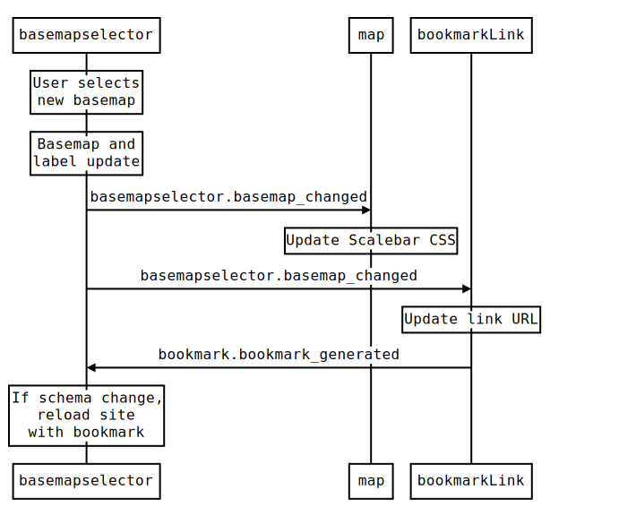
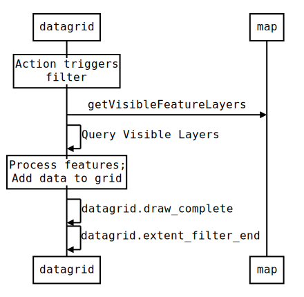
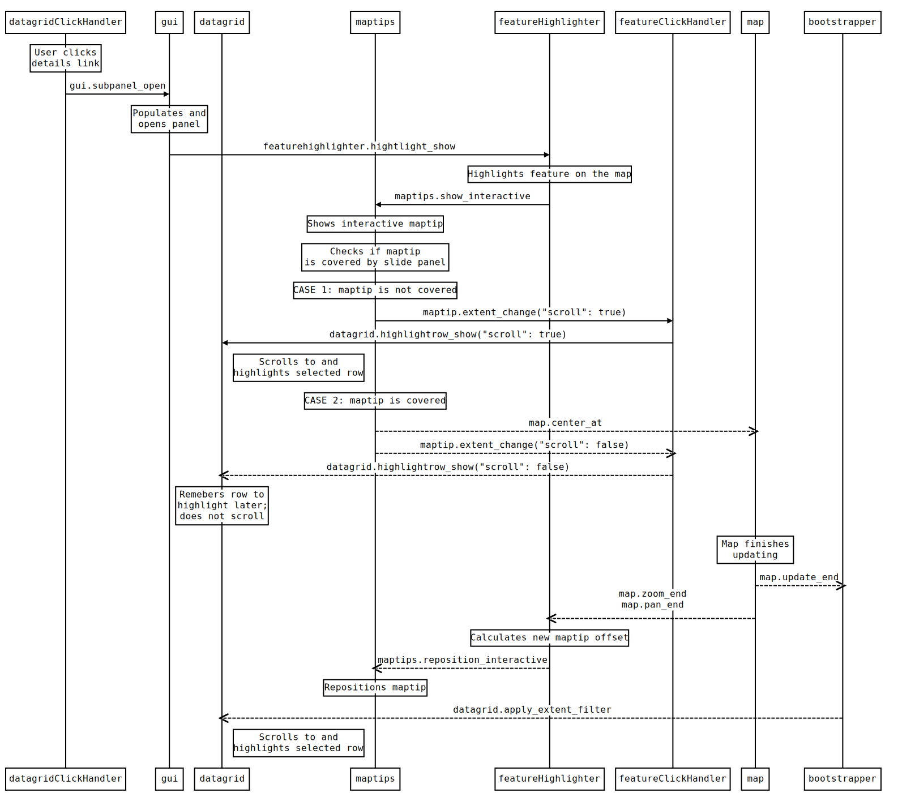
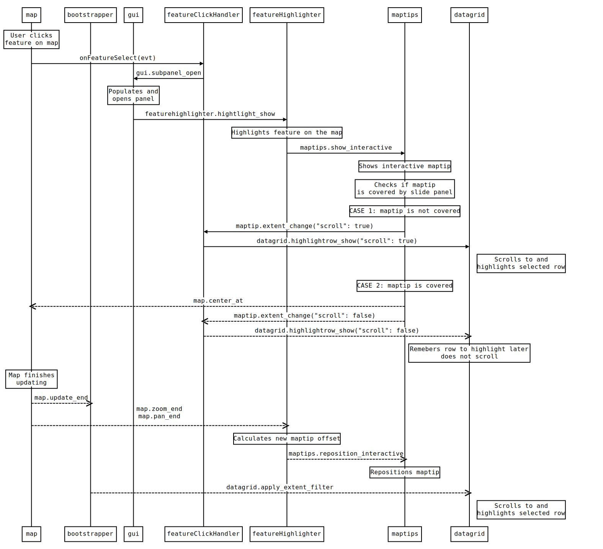
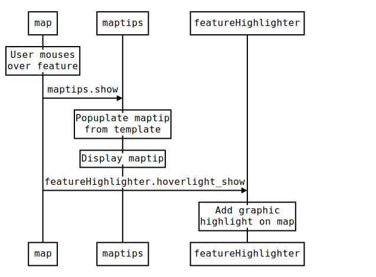
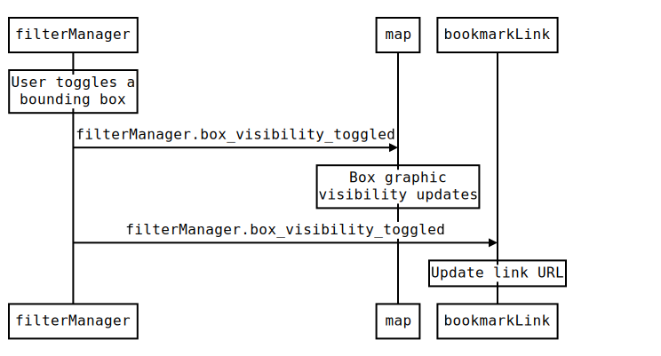



<a name="top" />

# RAMP Module Overview {#wb-cont}

## ramp/advancedToolbar {#advancedToolbar}

Provides a toolbar with tools that violate accessibility rules.  Will load and display tools from config definitions and [customized tool modules](advanced-toolbar-en.html).

| **API Page** | [AdvancedToolbar](../api/yuidoc/classes/AdvancedToolbar.html)
| **Relevant Configuration Nodes** | [advancedToolbar](json-config-en.html#advancedToolbar)
| **Template Summary** | [Advanced Tools](template-summary-en.html#advanced_tools)

[Back To Top](#top)
{: .text-right}

## ramp/basemapSelector {#basemapselector}

Manages the widget that allows the user to change the basemap. Utilizes the [esri.dijit.Basemap](https://developers.arcgis.com/javascript/jsapi/basemap-amd.html) dijit.  Populates the widget with basemaps from the config.  All basemaps must be in the same projection.

**Relevant Sequence Diagrams**

<section class="wb-lbx lbx-gal">
    
</section>

| **API Page** | [BaseMapSelector](../api/yuidoc/classes/BaseMapSelector.html)
| **Relevant Configuration Nodes** | [basemaps](json-config-en.html#basemaps)
| **Template Summary** | [Basemap Selector](template-summary-en.html#basemap_selector)

[Back To Top](#top)
{: .text-right}

## ramp/bookmarkLink {#bookmarklink}

Manages the widget that allows the maps current state to be displayed as a URL.  Listens for specific site events and updates the link as they occur.  Allows emailing of link, url shortning of link.

| **API Page** | [BookmarkLink](../api/yuidoc/classes/BookmarkLink.html)
| **Relevant Configuration Nodes** | [lang](json-config-en.html#lang_field)

[Back To Top](#top)
{: .text-right}

## ramp/datagrid {#datagrid}

The module handles the construction and population of the data grid.

#### Table Creation
The table structure is generated using the [datatables](external-libraries-en.html#datatables) library. The content and styling of the data grid can be configured using the JSON configuration file.
Population of grid rows consists of determining visible features, generating column data (this includes applying templates), and filling the grid with the result set.

#### Datagrid Modes
The datagrid has two states: summary and extended. In summary mode, only the most basic information about each feature (such the layer it belongs to, its name, and its icon on the map) is presented.
In the extended mode, detailed information about each feature is provided in each column. The map is visible when the user is in summary mode, however the map is hidden when the user switches
to the extended mode. The data grid is destroyed and reconstructed each time the user switches between the summary and extended mode.

#### Extent Filtering
Each time the extent of the map is changed (via a pan or zoom operation), the datagrid updates to show only the features that are visible in the current extent. The bottom of the datagrid contains
a record count to notify the user of the number of features currently visible on the map versus the total number of features in the entire map. The extent filter behaviour can be toggled in the extended
grid using the [extendedExtentFilterEnabled](json-config-en.html#datagrid_extendedextentfilterenabled) field. The summary grid will always have the extent filter enabled.

#### Pagination
Pagination is a custom plugin into the datatables library

#### Sorting
Sorting is provided out-of-the-box by the datatables library.

#### Feature Selection
Whenever the user clicks on a feature on the map, the corresponding row in the summary grid is highlighted. This is done by caching the object IDs of all the features and mapping them to the index of the feature in the datagrid.
Once the user clicks on a feature, the index is retrieved and the datagrid navigates to the correct page using the datatables pagination functions and scrolls to the correct row using JQuery.

#### Details and Zoom Buttons
The grid contains buttons to obtain details and zoom to row items.  This is done via the dataGridClickHandler module (see below).  In future releases, we plan to have this extensible to allow easy overriding of the controls.

**Relevant Sequence Diagrams**

<section class="wb-lbx lbx-gal">
    
</section>

| **API Page** | [Datagrid](../api/yuidoc/classes/Datagrid.html) |
| **Relevant Configuration Nodes** | [datagrid](json-config-en.html#datagrid)   [featureLayers[].datagrid](json-config-en.html#featurelayers_datagrid)   [gridstrings](json-config-en.html#gridstrings) |
| **Template Summary** | [Datagrid Summary Mode](template-summary-en.html#datagrid_summary_mode)   [Datagrid Expanded Mode](template-summary-en.html#datagrid_expanded_mode) |

[Back To Top](#top)
{: .text-right}

## ramp/datagridClickHandler {#datagridclickhandler}

The module contains the handler functions that react to buttons in the datagrid being clicked.  Primarily this covers implementation of the Details and Zoom To buttons.  In future releases we intend to have these functions easily extendable.

The zoom function consists of the map zooming to the feature in question, where it will be highlighted and an anchor tip will be displayed.

The view detail function involves generating a custom detail report (from a template) and displaying it in a slide-out panel.

**Relevant Sequence Diagrams**

<section class="wb-lbx lbx-gal">
    
</section>

<section class="wb-lbx lbx-gal">
    
</section>

| **API Page** | [DatagridClickHandler](../api/yuidoc/classes/DatagridClickHandler.html)

[Back To Top](#top)
{: .text-right}

## ramp/eventManager {#eventmanager}

The module defines event names as constants to avoid typing errors.

| **API Page** | [EventManager](../api/yuidoc/classes/EventManager.html)

[Back To Top](#top)
{: .text-right}

## ramp/featureClickHandler {#featureclickhandler}

The module contains the handler functions that react to the mouse interacting with features on the map.

This primarily consists of clicking a feature, and hovering over a feature.  For the most part, this class publishes appropriate events; the event listeners in other classes implement the reaction to the interactions.

**Relevant Sequence Diagrams**

<section class="wb-lbx lbx-gal">
    
</section>

<section class="wb-lbx lbx-gal">
    
</section>

| **API Page** | [FeatureClickHandler](../api/yuidoc/classes/FeatureClickHandler.html)

[Back To Top](#top)
{: .text-right}

## ramp/featureHighlighter {#featurehighlighter}

The module implements the highlighting of features on the map during hover and selection actions.

There are three types of highlighting: Click highlighting, Zoom highlighting, and Hover highlighting.  All are acomplished by fading out the map and duplicating the feature in question in a highliting layer, shown at regular brightness above the faded items.

The module also generates the graphic layers used to manage the highlight imagery

**Relevant Sequence Diagrams**

<section class="wb-lbx lbx-gal">
    
</section>

<section class="wb-lbx lbx-gal">
    
</section>

<section class="wb-lbx lbx-gal">
    
</section>

| **API Page** | [FeatureHighlighter](../api/yuidoc/classes/FeatureHighlighter.html)

[Back To Top](#top)
{: .text-right}

## ramp/filterManager {#filtermanager}

The module implements the generation of the filter control, and implements the filtering.

There is only layer-level filtering in the Arctic Fox version of RAMP. I.e. a layer can be on or off.  Future versions plan to include more granular filtering, such as by-attribute filters.

The following actions are performed by the module

* Generate the filter interface (including using templates)
* Handle the toggling of layers
* Handle the toggling of bounding boxes for layers
* Handle the changing of layer's opacity through the Settings panel
* Changing the draw order of layers on the map

**Relevant Sequence Diagrams**

<section class="wb-lbx lbx-gal">
    
</section>

<section class="wb-lbx lbx-gal">
    
</section>

<section class="wb-lbx lbx-gal">
    
</section>

| **API Page** | [FilterManager](../api/yuidoc/classes/FilterManager.html)
| **Relevant Configuration Nodes** |  [featureLayers[].id](json-config-en.html#featurelayers_id)   [featureLayers[].displayName](json-config-en.html#featurelayers_displayname)   [featureLayers[].symbology](json-config-en.html#featurelayers_symbology)    [featureLayers[].settings](json-config-en.html#featurelayers_settings)
| **Template Summary** | [Filter Global Row](template-summary-en.html#filter_global_row)   [Filter Row](template-summary-en.html#filter_row)

[Back To Top](#top)
{: .text-right}

## ramp/globalStorage {#globalstorage}

The module defines global items to make things easier to share across modules.  We place location specific string here (e.g. a configuration server URL), so this servers as the spot to tweak when moving the application to a different environment.  Implementers can also add items to this module on the fly.

| **API Page** | [GlobalStorage](../api/yuidoc/classes/GlobalStorage.html)

[Back To Top](#top)
{: .text-right}

## ramp/graphicExtension {#graphicextension}

The module contains helper functions for [graphic](https://developers.arcgis.com/javascript/jsapi/graphic-amd.html) objects.  E.g. get objectId, get layer, get detail text

| **API Page** | [GraphicExtension](../api/yuidoc/classes/GraphicExtension.html)
| **Relevant Configuration Nodes** | [featureLayers[].detailTemplate](json-config-en.html#featurelayers_detailtemplate)

[Back To Top](#top)
{: .text-right}

## ramp/gui {#gui}

Contains the gui related logic for the app.

Has a subpanel prototype.  This defines properties, constructor / destructor, open/close animation methods, content update.

Implements the side panel, help popup, add layer popup and registers those panels.

Contains logic to go to full-screen mode.

| **API Page** | [GUI](../api/yuidoc/classes/GUI.html)
| **Relevant Configuration Nodes** |  [stringResources](json-config-en.html#stringresources)
| **Template Summary** | [Feature Details Panel](template-summary-en.html#feature_details_panel)

[Back To Top](#top)
{: .text-right}

## ramp/map {#map}

The map module generates the map control and adds layers to the map, as defined in the configuration.

It also generates and hosts the scale bar.

**Relevant Sequence Diagrams**

<section class="wb-lbx lbx-gal">
    
</section>

| **API Page** | [Map](../api/yuidoc/classes/Map.html)
| **Relevant Configuration Nodes** | [basemaps[].showOnInit](json-config-en.html#basemaps_showoninit)   [basemaps[].url](json-config-en.html#basemaps_url)   [extents](json-config-en.html#extents)   [featureLayers[].url](json-config-en.html#featurelayers_url)   [featureLayers[].layerAttributes](json-config-en.html#featurelayers_layerattributes)   `featureLayers[].staticLayers`   [levelOfDetails.minLevel](json-config-en.html#levelofdetails_minlevel)   [levelOfDetails.maxLevel](json-config-en.html#levelofdetails_maxlevel)   [spatialReference](json-config-en.html#spatialreference)

[Back To Top](#top)
{: .text-right}

## ramp/maptips {#maptips}

The module handles maptip interaction (both hover and anchor). Includes positioning logic for tips.

Fills the tips with contents from the template.

**Relevant Sequence Diagrams**

<section class="wb-lbx lbx-gal">
    
</section>

<section class="wb-lbx lbx-gal">
    
</section>

| **API Page** | [Maptips](../api/yuidoc/classes/Maptips.html)
| **Relevant Configuration Nodes** | [featureLayers[].mapTipSettings](json-config-en.html#featurelayers_maptipsettings)
| **Template Summary** | [Feature Hover Tip](template-summary-en.html#feature_hover_tip)   Feature Anchor Tip](template-summary-en.html#feature_anchor_tip)

[Back To Top](#top)
{: .text-right}

## ramp/navigation {#navigationmodule}

The module handles the navigation widget.  It constructs it and applies a CSS skin to it.

Also handles the two-way synchronization between the map extent and the widget state.

| **API Page** | [Navigation](../api/yuidoc/classes/Navigation.html)
| **Relevant Configuration Nodes**  | [navWidget](json-config-en.html#navwidget)

[Back To Top](#top)
{: .text-right}

## ramp/quickzoom {#quickzoom}

Quick zoom widget is populated with target items, will zoom the map when an item is selected

THIS ITEM IS UNDER CONSIDERATION FOR COMPLETE OVERHAUL

NOTE: Depends on one of our quickzoom services.  These will be on public production after 10.1 migration.

NOTE: our current config file does not have the appropriate node.  We should add this to the sample

| **API Page** | [QuickZoom](../api/yuidoc/classes/QuickZoom.html)
| **Relevant Configuration Nodes** | `quickzoom`

[Back To Top](#top)
{: .text-right}

## ramp/ramp {#ramp}

The map module contains shared functions used by RAMP.  In particular, it houses functions that depend on the configuration object.

| **API Page** | [RAMP](../api/yuidoc/classes/RAMP.html)

[Back To Top](#top)
{: .text-right}