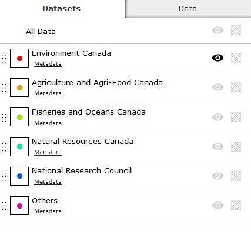

<a name="top" />

# RAMP Quick Start Guide {#wb-cont}



Welcome to RAMP Quick Start Guide. In this guide, we will be showing you how to setup your own web map using RAMP.
[View live sample]({{BASE_PATH}}/demos/NRSTC/ramp-gcwu-fegc-map.html)

##Requirements

This guide assumes you have downloaded the RAMP source from Github, and have run the Grunt build script. If not, please visit the [Getting Started]({{ BASE_PATH }}/docs/started-en.html) page to get your environment setup.

### Map resources

We will be using the Natural Resources Canada’s basemap in our example. As for the map layers, we will be using a snapshot of the dataset from Science.gc.ca's Research Centres map layer.

URL to Natural Resources Canada basemap

[http://geoappext.nrcan.gc.ca/arcgis/rest/services/BaseMaps/CBMT3978/MapServer](http://geoappext.nrcan.gc.ca/arcgis/rest/services/BaseMaps/CBMT3978/MapServer?f=jsapi)

URL to sample research centre map layers

[http://maps-cartes.ec.gc.ca/ArcGIS/rest/services/RAMP_NRSTC/MapServer/](http://maps-cartes.ec.gc.ca/ArcGIS/rest/services/RAMP_NRSTC/MapServer/)

Layer 0 - Environment Canada Research Centres

Layer 1 - Agriculture and Agri-Food Canada Research Centres

Layer 2 - Fisheries and Oceans Canada Research Centres

Layer 3 - Natural Resources Canada

Layer 4 - National Research Council

Layer 5 - Other Centres

[Back To Top](#top)
{: .text-right}

##Setting up your map layers

### Add a basemap layer

To configure a basemap for your RAMP based web mapping application, open the config.json file via any text editor or [json editor](http://www.jsoneditoronline.org). Search for \"basemaps\" to locate
the basemaps configuration section. By default, RAMP has 5 basemap layers configured. You can delete all and add your own, or use any existing one. For our example, we will keep
basemap baseNrCan and delete the remaining basemap configurations.

Basemap configuration

* id:
* url: http://geoappext.nrcan.gc.ca/arcgis/rest/services/BaseMaps/CBMT3978/MapServer
* thumbnail
* showOnInit: true
* scaleCssClass
* type: \"Topographic\"
* name: \"Canada Atlas"
* altText: \"Topotraphic Map\"
* description: \"NRCan CBMT3978\"

This will setup your RAMP basemap. When you start your web map application, the NRCan basemap will be displayed.

### Add a feature layer

In the Research Centre map layers, we have six layers available. We will be populating featureLayers section with those six layers.
With the config.json opened, Look for “featureLayers” section.  This section is where we will be adding Research Centre layers.

The main attributes to be modified will be the following:

* id: “layer_ec”
* displayName: “Environment Canada”
* url: http://maps-cartes.ec.gc.ca/ArcGIS/rest/services/RAMP_NRSTC/MapServer/0/
* These attribute will be used in the filter manager \(Datasets Tab\) to display information for each layer.

To display the legend image properly in the filter manager \(Datasets Tab\), you will need to provide the feature image url and
alt text for the image in the following fields.

symbology->icon->default->
	* imageUrl:
	* legendText:

To display the individual feature data (in our case, the Research Centre name) in the Data tab; you will need to populate
the nameField with the field name you wish to display. In our case it will be the “Research_Centre_en” field that will contain the research centre name.

nameField: "Research_Centre_en"

[Back To Top](#top)
{: .text-right}

##Map Tip Configuration
By default, hover map tip and anchor map tip use generic RAMP templates called __feature_hover_maptip_template.json__ and __anchored_map_tip.json__ template.
These templates are located in __src\\js\\RAMP\\Modules\\templates__ folder.

If you open the template file, you will see it’s using the nameField attribute of a featureLayer config object. Therefore, by default, if you have
configure the nameField attribute, the hover maptip and anchor map tip will use the same field vale to be displayed in the map tip. In our Research
Centres Map, we set the nameField attribute to “Research_Centre_en”; which is the name of the research centre. So when we move our cursor close to a
feature, the hover map tip displays the name of the research centre.

To customize the content of map tips, please refer to the [template guide](template-guide-en.html) on how to customize the template.

[Back To Top](#top)
{: .text-right}

##Setting up the Datagrid

In RAMP, datagrid comes in two states\: extended datagrid and summary datagrid. By default, summary datagrid is displayed.

When you click on the “Full data” link button, extended datagrid is displayed.

In this section, we will show you how to configure the exteneded datagrid.

### Summary Datagrid

Summary datagrid uses templates in datagrid_template.json file to generate the content. If you open the template file and associated helper function in tmplUtil.js, you will see the familiar fields being used to generate the individual rows:
displayName, imageUrl, and nameField.
Therefore, by default, summary datagrid is configured if you have the above mentioned featureLayer configuration object setup.

### Extended Datagrid

In RAMP, multiple layers can be configured to be displayed on the map; therefore, data available to each layer can be different from each other.
 A drop down is provided in the extended datagrid to separate the data from the layer source. The configuration associated with each map layer is located
in the gridColumns collection of the datagrid object, found in the featureLayers section of the configuration file.

You can display any number of columns in the extended datagrid by adding grid column configuration to the gridColumns array.

The following attributes are available for each grid column:

* id\: unique id to identify the column
* fieldName\: field name to access the data value. If using a default grid cell template, this field name will be used to supply data
* width: column width (e.g. 50px)
* isSortable\: a flag to determine if the given column can be sortable
* sortType\: type of sorting algorithm for the given column
* alignment\: column alignment (e.g. 1)
* title\: column heading
* columnTemplate\: The template used to generate content for the given column.

For detailed information on the column configuration, please refer to [DataTables](http://www.datatables.net/) documentation.

#### Column Template
Column Template is used in RAMP to generate the content for each column. There are four default templates available with RAMP these are:

* unformatted_grid_value\: generate content based on the column index and field name
* title_span\: tooltiped grid value
* graphic_icon\: icon template that generate icon from current layer image
* details_button\: generate a button that will open the detail panel for a given feature.

You can add and customize templates by adding or modifying the templates in this file. For more information on customizing template, please refer to the [Template Guide](template-guide-en.html)

### Add a WMS layer

To configure a WMS layer for your RAMP based web mapping application, open the config.json file via any text editor or [json editor](http://www.jsoneditoronline.org). Search for \"wmsLayers\" to locate
the [WMS configuration section](json-config-en.html#wmsLayers).  Add an object to the collection for each WMS layer you wish to add.  

WMS Layer configuration

Critical Fields

* extent.spatialReference:  The projection needs to be compatible with the current basemap
* url: The root service for the WMS
* layerInfo.name: This must match the Name value of the layer you wish to show.  These values can be found via the WMS getCapabilities function
* layerInfo.title: Similar to name, must match the WMS layer value

When you start your web map application, the WMS layers will be displayed.

[Back To Top](#top)
{: .text-right}