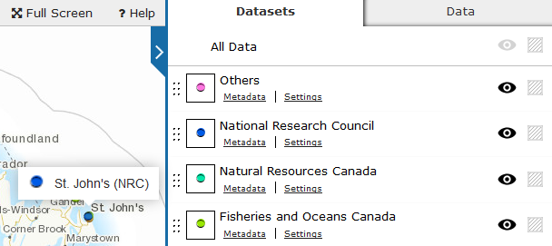
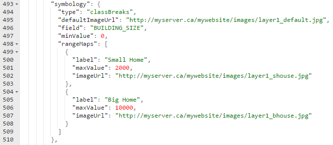

<a name="top" />

# RAMP Quick Start Guide {#wb-cont}

Welcome to RAMP Quick Start Guide. In this guide, we will be showing you how to setup your own web map using RAMP by adjusting the configuration file.  No programming required!
[View live sample]({{BASE_PATH}}/demos/NRSTC/ramp-gcwu-fegc-map.html)

##Requirements

This guide assumes you have downloaded the RAMP source from Github, and have run the Grunt build script. If not, please visit the [Getting Started]({{ BASE_PATH }}/docs/started-en.html) page to get your environment setup.

### Map resources

In this guide, examples will be provided using existing web services.  We will be using the [Natural Resources Canada](http://geoappext.nrcan.gc.ca/arcgis/rest/services/BaseMaps/CBMT3978/MapServer)’s basemap in our example. As for the feature layers, we will be using a snapshot of the dataset from Science.gc.ca's [Research Centres map layer](http://maps-cartes.ec.gc.ca/ArcGIS/rest/services/RAMP_NRSTC/MapServer/).

Layer 0 - Environment Canada Research Centres

Layer 1 - Agriculture and Agri-Food Canada Research Centres

Layer 2 - Fisheries and Oceans Canada Research Centres

Layer 3 - Natural Resources Canada

Layer 4 - National Research Council

Layer 5 - Other Centres

[Back To Top](#top)
{: .text-right}

### JSON Editor

RAMP is designed so that data layers and common settings can be set via a configuration file or service.  Of course, more complex customizations can be made to the RAMP code, but a standard "here is my data on a map" website can be set up simply by adjusting the configuration file.  The configuration files are located in the root of build folder, there is one for both languages.  The file can be updated using a text editor or a [json editor](http://www.jsoneditoronline.org).

A full layout of the configuration file can be found [here](json-config-en.html).

##Adding a Basemap Layer

The basemaps configuration section defines what basemaps are available in the app.  You can delete all and add your own, or use any existing one.  Keep in mind that all basemaps must be in the same projection and have the same scale levels defined, otherwise a differing basemap will not draw.  Details on the basemap configuration objects can be found [here](json-config-en.html#basemaps).

## Adding an ESRI Feature Layer

ESRI feature layers allow the display of feature data on the map, along with attribute data shown in grids and interactive elements such as hovertips and feature highlighting.

Feature layers to be included in the map are defined in the “layers.feature” section of the configuration file.  The feature configuration objects are the most complex in the app, and are fully defined [here](json-config-en.html#featurelayers_id).  Note that many of the configuration items are optional, allowing for smaller nodes if the default values are acceptable.

The main attributes to be modified will be the following:

* id: Should be unique to the application.
* displayName: An appropriate name for the layer.  It will be displayed in the layer selector.
* url: A rest endpoint to the ESRI feature service for this layer.
* nameField: The attribute field that best describes each feature.  This will be displayed in maptips and the summary data grid

[Back To Top](#top)
{: .text-right}

###Symbology Configuration

Feature layers also need to have a legend / symbology structure to inform the app how to create a legend, and how to derive appropriate icons for each feature.  RAMP currently supports the three most common renderer types from an ESRI feature service: [Simple renderers, Unique Value renderers, and Class Breaks renderers](http://resources.arcgis.com/en/help/arcgis-rest-api/#/Renderer_objects/02r30000019t000000/).  This information is used to display icons in maptips, datagrids, the layer selector, and the view legend function.

The symbology details are defined in the symbology node of the feature layer's config object.  The content of the symbology node can differ based on the renderer type.  A simple renderer defines one symbol for the entire layer.

Unique Value symbology definitions contain a mapping of values to icon images.

Class Breaks symbology definitions contain a mapping of ranges of values to icon images.

	
Detailed renderer structures can be found in the [config page](json-config-en.html#featurelayers_symbology)	
	

[Back To Top](#top)
{: .text-right}

###Map Tip Configuration

Maptips can quickly display information about a feature.  RAMP implements two types of maptips.  Hover Maptips show when the user mouses over a feature, and disappears when the mouse goes elsewhere.  Anchor Maptips show when the user is viewing the details of a feature, giving a visual cue to what item on the map the details panel is referring to.  Anchor Maptips remain on the map until the detail panel is closed.

The contents of the maptips are driven by templates.  By default, hover map tip and anchor map tip use generic RAMP templates called __feature_hover_maptip_template.json__ and __anchored_map_tip.json__ template.
These templates are located in __src\\js\\RAMP\\Modules\\templates__ folder.  These templates display a basic "icon and name" for a feature.  The name data is derived from the "nameField" in the layer's configuration.  If a custom template is desired, new templates can be added to the above JSON files.  To instruct the layer to use a different template, update the values in the templates.hover or templates.anchor configuration nodes to reflect the name of the custom template.  As the template names are optional, you may need to add the nodes in your JSON editor.

To create custom templates, please refer to the [template guide](template-guide-en.html).

[Back To Top](#top)
{: .text-right}

###Setting up the Datagrid

RAMP displays tabular data in two different ways.  The Summary datagrid shows contains basic, feature identifying information, and provides links to get more details on an individual item.  The grid collates all features currently visible on the map across all feature layers.  It's small size allows the grid and map to both be visible at the same time.

The Extended datagrid shows a more traditional attribute table

When you click on the “Full data” link button, extended datagrid is displayed.

In this section, we will show you how to configure the exteneded datagrid.

### Summary Datagrid

Summary datagrid uses templates in datagrid_template.json file to generate the content. If you open the template file and associated helper function in tmplUtil.js, you will see the familiar fields being used to generate the individual rows:
displayName, imageUrl, and nameField.
Therefore, by default, summary datagrid is configured if you have the above mentioned featureLayer configuration object setup.

### Extended Datagrid

In RAMP, multiple layers can be configured to be displayed on the map; therefore, data available to each layer can be different from each other.
 A drop down is provided in the extended datagrid to separate the data from the layer source. The configuration associated with each map layer is located
in the gridColumns collection of the datagrid object, found in the featureLayers section of the configuration file.

You can display any number of columns in the extended datagrid by adding grid column configuration to the gridColumns array.

The following attributes are available for each grid column:

* id\: unique id to identify the column
* fieldName\: field name to access the data value. If using a default grid cell template, this field name will be used to supply data
* width: column width (e.g. 50px)
* isSortable\: a flag to determine if the given column can be sortable
* sortType\: type of sorting algorithm for the given column
* alignment\: column alignment (e.g. 1)
* title\: column heading
* columnTemplate\: The template used to generate content for the given column.

For detailed information on the column configuration, please refer to [DataTables](http://www.datatables.net/) documentation.

#### Column Template
Column Template is used in RAMP to generate the content for each column. There are four default templates available with RAMP these are:

* unformatted_grid_value\: Generate content based on the column index and field name.  Will display the raw value
* title_span\: Same as unformatted_grid_value, but if the value is large, it will be shortened and the full value will be displayed on mouse-hover via a tooltip.
* graphic_icon\: Will generate an icon based on the current feature and the layer's symbology.
* details_button\: Will generate a button that will open the detail panel for a given feature.

You can add and customize templates by adding or modifying the templates in this file. For more information on customizing template, please refer to the [Template Guide](template-guide-en.html)

### Add a WMS layer

To configure a WMS layer for your RAMP based web mapping application, open the config.json file via any text editor or [json editor](http://www.jsoneditoronline.org). Search for \"wmsLayers\" to locate
the [WMS configuration section](json-config-en.html#wmsLayers).  Add an object to the collection for each WMS layer you wish to add.  

WMS Layer configuration

Critical Fields

* extent.spatialReference:  The projection needs to be compatible with the current basemap
* url: The root service for the WMS
* layerInfo.name: This must match the Name value of the layer you wish to show.  These values can be found via the WMS getCapabilities function
* layerInfo.title: Similar to name, must match the WMS layer value

When you start your web map application, the WMS layers will be displayed.

[Back To Top](#top)
{: .text-right}